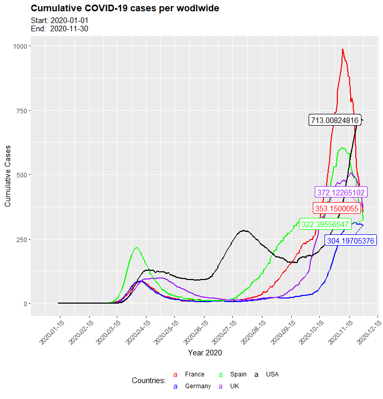
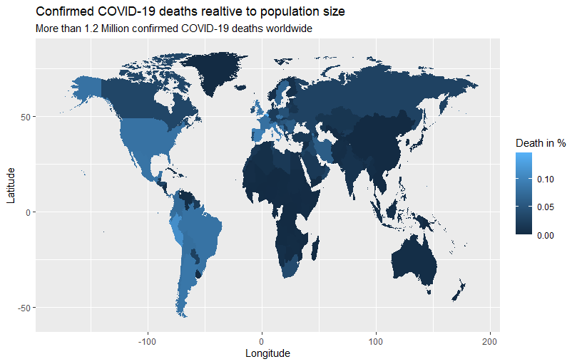

```{r setup, include=FALSE}
knitr::opts_chunk$set(message=FALSE,warning=FALSE, cache=TRUE)
```
BASIC DATA SCIENCE BASIC: Lab-journal over the Challenge which had to be solved.

# Challenge 1
Last compiled: `r Sys.Date()`

## Analyze the sales by states
In the following code-window you can see the code for plotting the revenues of each state in a bar chart. As you can see in the figure, Nort Rhine-Westphalia has the highest revenues with 21200613 Euros.
`r knitr::spin_child("task1_1.R")`

## Analyze the sales by location (state) and year
`r knitr::spin_child("task1_2.R")`

# Challenge 2
## Get some data via an API
Last compiled: `r Sys.Date()`

I looked for an API which gives a list of historical motor racing drivers. First of all I had a look at all given datas. After that I picked a few categories which gve information over the drivers and sorted the drivers by the year birth. Furthermore I resorted the columns and added an additional line which only contains the year of birth and placed it as first column to have a better overview. 

`r knitr::spin_child("task2_1.R")`

## Get data from a competitor of canyom
For this challenge I chose to acquire date of the company rosebikes. Therefor I had a closer look on the race model X-LITE FOUR DISC. For this model you can find four sub-models which are listed in the following tabular together with its prices. 
`r knitr::spin_child("task2_2.R")`

# Challenge 3
In this challenge 3 questions had do be answered.
## Task 1: Patent Dominance
What US company / corporation has the most patents? List the 10 US companies with the most assigned/granted patents.
To answer this question I summed the patents per company and listed the number of total patents by descending order so that the top-10-companies could be found in the first 10 columns.
```{r task3_1, eval=FALSE}
# 1.0 Load librarys
library(tidyverse)
library(vroom)
library(data.table)
library(vroom)

# 2.0 Load Data: patent_assignee.tsv, assignee.tsv
patentAssignee_tbl <- vroom(
  file       = "patent_assignee.tsv", 
  delim      = "\t", 
  # col_types  = col_types,
  na         = c("", "NA", "NULL")
)

assignee_tbl <- vroom(
  file       = "assignee.tsv", 
  delim      = "\t", 
  #col_types  = col_types,
  na         = c("", "NA", "NULL")
)

# 3.0 Merge the data + create data table
assigneeMerged <- merge(x = patentAssignee_tbl, y = assignee_tbl, by.x='assignee_id', by.y = "id", all = T)
# create Data table
class(assigneeMerged)
setDT(assigneeMerged)
class(assigneeMerged)
assigneeMerged %>% glimpse()


# 4.0 group + sum by company
setkey(assigneeMerged, "organization")
key(assigneeMerged)

assigneeMergedCount <- assigneeMerged %>%
  filter(!is.na(organization)) %>%
  count(organization) 

assigneeMergedCount <- assigneeMergedCount %>%
  arrange(desc(n))

## List the 10 US companies with the most assigned/granted patents
top10 <- assigneeMergedCount[1:10]

write_rds(top10, "top10.rds")
```

```{r result3_1}
library(readr)
library(data.table)
result <- read_rds("02_data_wrangling/top10.rds")
result
```

## Task 2: Recent patent acitivity
What US company had the most patents granted in 2019? List the top 10 companies with the most new granted patents for 2019.
To solve this task I first merged put all the tables into one table and removed all datas which weren't from 2019. Than again I counted the number of patents per company and sorted the number in descending order.
```{r task3_2, eval=FALSE}
# 1.0 Load librarys
library(tidyverse)
library(vroom)
library(data.table)
library(vroom)

# 2.0 load necessary data

col_types <- list(
  id = col_character(),
  country = col_character(),
  date = col_date("%Y-%m-%d")
)

patent_tbl <- vroom(file = "patent.tsv", delim = "\t", col_types  = col_types, na = c("", "NA", "NULL"), col_select = c(id, country, date))
# replace whole date by year
patent_tbl <- mutate(patent_tbl, date = year(date))

# load merged data-table from previous task
assigneMerged_tbl <- read_rds("assigneMerged_tbl.rds")
assigneMerged_tbl <- select(assigneMerged_tbl, patent_id, organization)

# merge the tables
patent_tbl <- merge(x = assigneMerged_tbl, y = patent_tbl, by.x='patent_id', by.y = "id", all = T)

# select year 2019 and display in descending order
patent2019_tbl <- patent_tbl %>% 
  select(date, organization) %>%
  filter(date == 2019)

patent2019_tbl <- patent2019_tbl %>%
  filter(!is.na(organization)) %>%
  count(organization)

patent2019_tbl <- patent2019_tbl %>%
  arrange(desc(n))

top10_2019 <- patent2019_tbl[1:10]
write_rds(top10_2019, "top10_2019.rds")
```

```{r result3_2}
library(readr)
library(data.table)
result_2019 <- read_rds("02_data_wrangling/top10_2019.rds")
result_2019
```

## Task 3: Top 5 main classes from the top 10 countries
What is the most innovative tech sector? For the top 10 companies (worldwide) with the most patents, what are the top 5 USPTO tech main classes?

For this task I filtered the merged tables by the top-10-countries from the previous task. The created data set only contains the data from the top-10-countries and thus the task could be solved easily by counting and arranging in descendant order.
```{r task3_3, eval=FALSE}
# 1.0 Load librarys
library(tidyverse)
library(vroom)
library(data.table)
library(vroom)

# 2.0 load necessary data
uspc_tbl <- vroom(
  file       = "uspc.tsv", 
  delim      = "\t", 
  na         = c("", "NA", "NULL")
)

# top 10 countries which have been determined in task 1
top10_tbl <- read_rds("top10.rds")
top10_tbl <- top10_tbl$organization

# load merged data-table from previous task (assignee + patent_assignee)
assigneMerged_tbl <- read_rds("assigneMerged_tbl.rds")
assigneMerged_tbl <- select(assigneMerged_tbl, patent_id, organization)

# 3.0 Data processing
# merge the tables by patent_id
assigneMerged_tbl <- merge(x = assigneMerged_tbl, y = uspc_tbl, by.x='patent_id', by.y = "patent_id", all = T) 

# filter out NA-values and only show top-10-countries
assigneMerged_tbl <- assigneMerged_tbl %>%
  filter(!is.na(mainclass_id))
assigneMerged_tbl <- assigneMerged_tbl %>%
  filter(organization %in% top10_tbl)

# calculate top 10 main classes
mainclassID_tbl <- assigneMerged_tbl %>%
 count(mainclass_id)
mainclassID_tbl <- arrange(mainclassID_tbl, desc(n))

# save result
top10_maincladdID <- mainclassID_tbl[1:5]
write_rds(top10_maincladdID, "top10_mainclassID.rds")
```

```{r result3_3}
library(readr)
library(data.table)
result_top5 <- read_rds("02_data_wrangling/top10_mainclassID.rds")
result_top5
```

# Challenge 4
## Graph with the cumulative COVID-19 cases
Map the time course of the cumulative Covid-19 cases!

First of all I loaded the necessary data and filtered it by the year 2020. As the cumulative cases were already given in the data-set, I plotted the cumulative-case-value for each day.
I used labels in the graph to plot the most recent Cumulative-case-value from the displayed countries.

```{r task4_1, eval=FALSE}
# 1.0 Library
library(tidyverse)
library(ggrepel)

#2.0 Load + merge Data
covid_data_tbl <- read_csv("https://opendata.ecdc.europa.eu/covid19/casedistribution/csv") %>%
  select(month, year, day, countriesAndTerritories, starts_with("Cumulative_number_for"),dateRep) %>%
  mutate(across(countriesAndTerritories, str_replace_all, "_", " ")) %>%
  mutate(countriesAndTerritories = case_when(
    countriesAndTerritories == "United Kingdom" ~ "UK",
    countriesAndTerritories == "United States of America" ~ "USA",
    countriesAndTerritories == "Czechia" ~ "Czech Republic",
    TRUE ~ countriesAndTerritories
  )) %>%
  filter(countriesAndTerritories %in% c("Germany", "UK", "France", "Spain", "USA")) %>%
  filter(year == 2020) %>%
  filter(month < 12) %>%
  group_by(countriesAndTerritories, month) %>%
  ungroup()

names(covid_data_tbl)[5] <- "Cumulative_number"

# variables for labeling the newest COVID-number
xy <- covid_data_tbl %>%
  filter(dateRep == "30/11/2020")

label = xy$Cumulative_number

y <- xy$Cumulative_number
x<- as.Date(lubridate::dmy(xy$dateRep))
  
# 3.0 Create Graph
covid_data_tbl %>%
  ggplot(aes(as.Date(lubridate::dmy(dateRep)), Cumulative_number, color = countriesAndTerritories)) +
  geom_line(size = 1) +

labs(
  title = str_glue("Cumulative COVID-19 cases per wodlwide"),
  subtitle = str_glue(
    "Start: {(min(lubridate::dmy(covid_data_tbl$dateRep)))}
               End:  {(max(lubridate::dmy(covid_data_tbl$dateRep)))}"),
  x = "Year 2020",
  y = "Cumulative Cases"
) +
  
  scale_x_date(breaks = function(x) seq.Date(from = min(x), 
                                             to = max(x), 
                                             by = "1 month")) +
  
  scale_color_manual("Countries:", values=c("red", "blue", "green", "purple", "black"), labels = waiver())+
  guides(col = guide_legend(nrow = 2))+
  
  theme(
    axis.text.x = element_text(angle = 45, hjust = 1),
    legend.position = "bottom",
    plot.title = element_text(face = "bold"),
    plot.caption = element_text(face = "bold.italic", color = "blue4")
  ) +
  geom_label_repel(aes(x = x, y = y, label = label), data = xy)
```


## World-map with COVID-19 deaths relative to population size
Visualize the distribution of the mortality rate (deaths / population) with geom_map().

For solving this task I first loaded the necessary data and then the world-map could be createt with the help of map_data("world") and the geom_map function.
```{r task4_2, eval=FALSE}
# 1.0 Library
library(tidyverse)
library(ggrepel)

# 2.0 Load + merge data
death_tbl <- read_csv("https://opendata.ecdc.europa.eu/covid19/casedistribution/csv") %>%
  select(deaths, countriesAndTerritories, popData2019,dateRep, countryterritoryCode) %>%
  mutate(across(countriesAndTerritories, str_replace_all, "_", " ")) %>%
  mutate(countriesAndTerritories = case_when(
    countriesAndTerritories == "United Kingdom" ~ "UK",
    countriesAndTerritories == "United States of America" ~ "USA",
    countriesAndTerritories == "Czechia" ~ "Czech Republic",
    TRUE ~ countriesAndTerritories
  )) %>%
  group_by(countriesAndTerritories, popData2019) %>%
  summarize(deaths = sum(deaths)) %>%
  mutate(deaths = (deaths/popData2019)*100) %>%
  select(countriesAndTerritories, deaths)

# 3.0 Create the worldmap with death-rates
  world <- map_data("world")
  life.exp.map <- merge(x=death_tbl, y=world_map, by.x = "countriesAndTerritories", by.y = "region")
  
  ggplot(life.exp.map, aes(map_id = countriesAndTerritories, fill = deaths))+
    geom_map(aes(map_id =  countriesAndTerritories), map = world )+
    expand_limits(x = life.exp.map$long, y = life.exp.map$lat)+
    #coord_fixed() +
    labs(
      title = str_glue("Confirmed COVID-19 deaths realtive to population size"),
      subtitle = str_glue("More than 1.2 Million confirmed COVID-19 deaths worldwide"),
      x = "Longitude",
      y = "Latitude"
    ) +
    scale_fill_continuous(name = "Death in %")
```



=======
>>>>>>> parent of b52b1ff... task 3
# Adding R stuff

So far this is just a blog where you can write in plain text and serve your writing to a webpage. One of the main purposes of this lab journal is to record your progress learning R. The reason I am asking you to use this process is because you can both make a website, and a lab journal, and learn R all in R-studio. This makes everything really convenient and in the same place. 

So, let's say you are learning how to make a histogram in R. For example, maybe you want to sample 100 numbers from a normal distribution with mean = 0, and standard deviation = 1, and then you want to plot a histogram. You can do this right here by using an r code block, like this:

```{r}
samples <- rnorm(100, mean=0, sd=1)
hist(samples)
```

When you knit this R Markdown document, you will see that the histogram is printed to the page, along with the R code. This document can be set up to hide the R code in the webpage, just delete the comment (hashtag) from the cold folding option in the yaml header up top. For purposes of letting yourself see the code, and me see the code, best to keep it the way that it is. You'll learn that all of these things and more can be customized in each R code block.